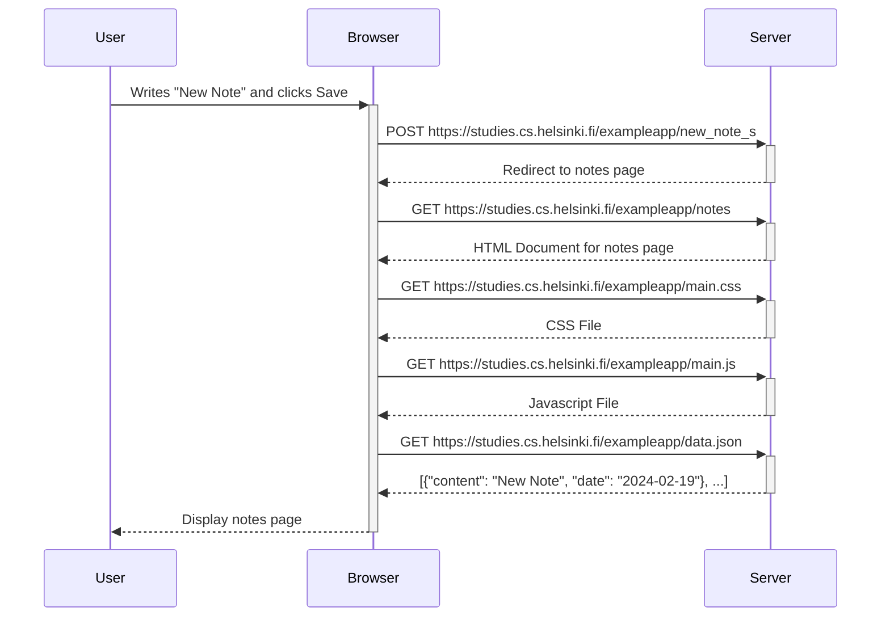

```mermaid
sequenceDiagram
    participant User as User
    participant Browser as Browser
    participant Server as Server

    User->>+Browser: Writes "New Note" and clicks Save
    Browser->>+Server: POST https://studies.cs.helsinki.fi/exampleapp/new_note_s
    Server-->>-Browser: Redirect to notes page
    Browser->>+Server: GET https://studies.cs.helsinki.fi/exampleapp/notes
    Server-->>-Browser: HTML Document for notes page
    Browser->>+Server: GET https://studies.cs.helsinki.fi/exampleapp/main.css
    Server-->>-Browser: CSS File
    Browser->>+Server: GET https://studies.cs.helsinki.fi/exampleapp/main.js
    Server-->>-Browser: Javascript File
    Browser->>+Server: GET https://studies.cs.helsinki.fi/exampleapp/data.json
    Server-->>-Browser: [{"content": "New Note", "date": "2024-02-19"}, ...]
    Browser-->>-User: Display notes page
```
