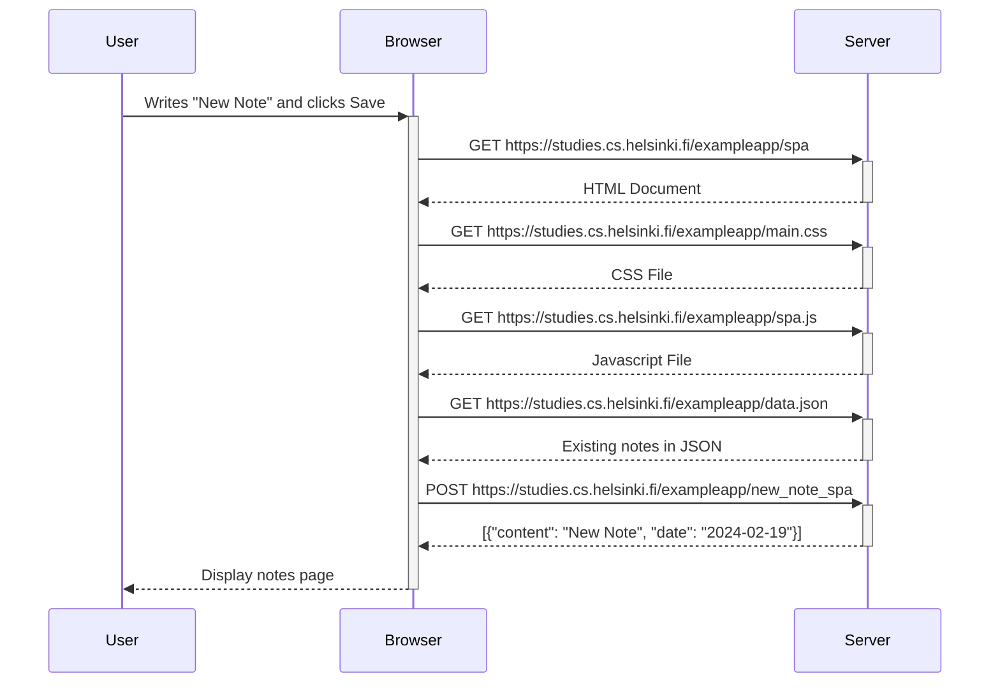

```mermaid
sequenceDiagram
    participant User as User
    participant Browser as Browser
    participant Server as Server

    User->>+Browser: Writes "New Note" and clicks Save
    Browser->>+Server: GET https://studies.cs.helsinki.fi/exampleapp/spa
    Server-->>-Browser: HTML Document
    Browser->>+Server: GET https://studies.cs.helsinki.fi/exampleapp/main.css
    Server-->>-Browser: CSS File
    Browser->>+Server: GET https://studies.cs.helsinki.fi/exampleapp/spa.js
    Server-->>-Browser: Javascript File
    Browser->>+Server: GET https://studies.cs.helsinki.fi/exampleapp/data.json
    Server-->>-Browser: Existing notes in JSON
    Browser->>+Server: POST https://studies.cs.helsinki.fi/exampleapp/new_note_spa
    Server-->>-Browser: [{"content": "New Note", "date": "2024-02-19"}]
    Browser-->>-User: Display notes page
```
